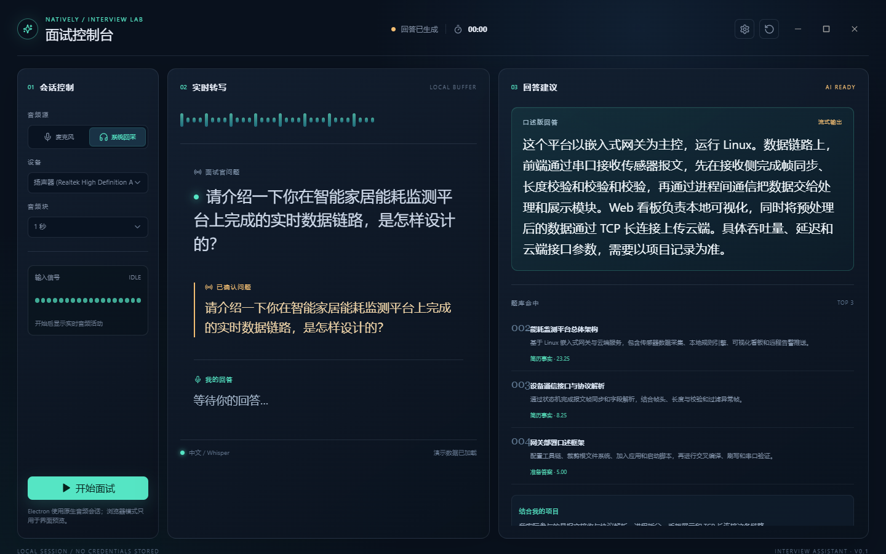

# Natively — AI 面试助手（本地增强版）

<div align="center">
  
</div>

> 个人/教育/研究/非商业用途的 **AI 面试助手**，实时转录面试音频、检索你的知识库、流式生成候选回答。
> 基于 [Natively](https://github.com/Natively-AI-assistant/natively-cluely-ai-assistant) 的 fork，本仓库在上游基础上做了面试场景的中文本地化增强。
> 遵循上游 **Natively Personal Use Source License v1.0**（源码可见、非商业），详见 [LICENSE](LICENSE)。

## 本地增强（interview-console）

本仓库的增强集中在 `src/interview-console/`，是一个面向中文面试场景的完整"面试台"模块：

- **面试轮次协调**：识别多问题轮次、聚合候选答案、处理追问与串题（`questionRoundCoordinator.ts`）
- **候选答案流式生成**：话音结束后快速预热检索与 prompt，流式输出候选回答（`candidateGeneration.ts`、`partialPrewarm.ts`）
- **延迟遥测**：记录事件时间戳，观测首字延迟与完整率（`latencyTelemetry.ts`）
- **诊断窗口**：可展开的轮次事件可视化面板（`roundEventsWindow.ts`）
- **回答历史**：候选/修正/最终状态的回答时间线（`answerHistory.ts`）
- **中文适配**：OpenCC 简体转换、中文问题意图识别（`simplifiedChinese.ts`、`questionTiming.ts`）
- **本地知识库检索**：基于简历事实与准备答案的向量/关键词检索（`knowledge_source/`）

<p align="center">
  
  <br/>
  <em>面试控制台（演示模式）：实时转录、知识库命中、流式候选回答与追问提示</em>
</p>

## ✨ 功能特性

- **实时面试辅助**：本地/云端语音转写 → 知识库检索 → 候选回答，边面试边提示
- **多模型支持**：OpenAI、Claude、Gemini、Groq、DeepSeek 兼容接口、本地 Ollama
- **本地优先**：你的 Key、你的模型、你的机器，数据不出本机
- **长期记忆**：可选 Hindsight 长程记忆（默认关闭）
- **多语言 UI**：含中文（zh）等

## 🚀 快速开始（Windows）

1. **下载安装包**：前往 [Releases](../../releases) 下载最新 `Natively Setup <version>.exe`，双击安装。
2. **启动应用**：从开始菜单启动。
3. **配置模型**：在应用内填入你的 LLM / 语音 API Key（或使用本地 Ollama），见 [配置](#配置)。
4. **准备知识库**：将简历事实与准备答案写入本地知识库（见 `knowledge_source/`），面试台即可检索引用。
5. **开始面试**：进入面试台，开启录音，跟随轮次提示。

> 未配置任何 Key 时，应用仍可启动，面试台可用本地兜底回复演示完整流程。

## 🛠 技术栈

- **桌面**：Electron + Vite + React + TypeScript
- **语音**：Whisper（本地/云端）、Deepgram / Azure / ElevenLabs 等可选
- **AI**：OpenAI / Claude / Gemini / Groq / Ollama 等兼容接口
- **原生**：sharp / sqlite-vec / onnx（native-module 重建）
- **打包**：electron-builder（NSIS / DMG）

## 📁 目录结构

```text
├── src/
│   ├── interview-console/   # 本地增强：面试台核心模块
│   ├── components/          # UI 组件
│   └── main.tsx             # 入口
├── electron/                # Electron 主进程（录音、转写、IPC）
├── native-module/           # 原生模块（音频采集等）
├── natively-browser/        # 浏览器内嵌渲染
├── knowledge_source/        # 本地知识库（简历事实、准备答案）
├── realtime_audio/          # 实时音频链路脚本
├── scripts/                 # 构建、打包、审计脚本
├── docs/                    # 开发文档
└── premium/                 # 上游 premium 子模块（可选）
```

## 💻 本地开发

前置要求：Node.js 18+、npm。

```powershell
npm install
npm run app:dev        # 启动 Electron 开发模式（含面试台）
```

**验证与构建**：

```powershell
npm run typecheck:electron   # 类型检查
npm test                      # 单元测试
npm run app:build             # 构建
npm run dist                  # 生成安装包（electron-builder）
```

## ⚙️ 配置

复制 `.env.example` 为 `.env`，按需填写（Key 仅存本机，不上传）：

```ini
OPENAI_API_KEY=
CLAUDE_API_KEY=
GEMINI_API_KEY=
GROQ_API_KEY=
DEEPGRAM_API_KEY=      # 语音转写（可选）
# 本地 AI（可选）
USE_OLLAMA=true
OLLAMA_MODEL=llama3.2
OLLAMA_URL=http://localhost:11434
```

`.env` 已在 `.gitignore` 中，不会提交。

## ⚠️ 许可与限制

- 本项目是 **Natively 的 fork**，遵循上游 `LICENSE`（Natively Personal Use Source License v1.0）：**个人、教育、研究、非商业用途**，源码可见但非开源协议。
- 禁止商业使用、付费分发、SaaS 化、重新许可。
- 本地知识库含真实个人信息时，请勿公开提交；仓库已通过 `.gitignore` 隔离本地题库与测试产物。
- 面试助手仅提供参考提示，不构成任何录用/职业建议。

## 📄 上游与致谢

- 上游项目：[Natively-AI-assistant/natively-cluely-ai-assistant](https://github.com/Natively-AI-assistant/natively-cluely-ai-assistant)
- 本项目保留了上游所有版权声明与许可证。
